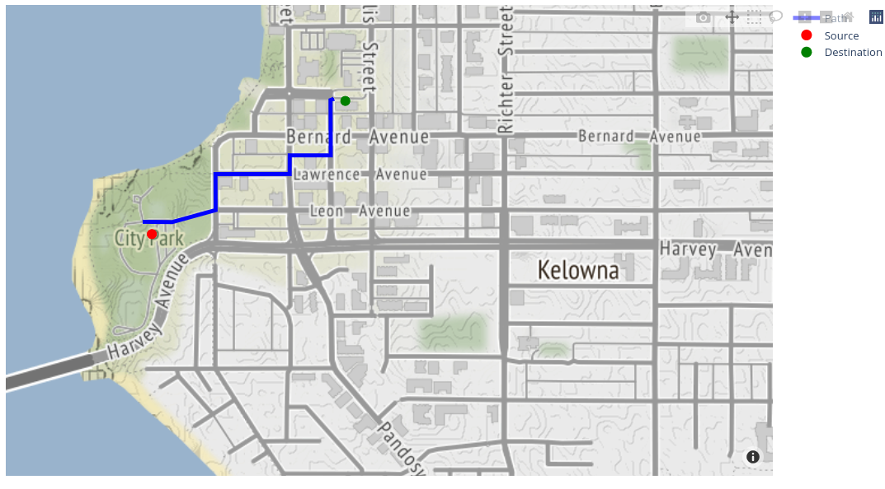

# Path Planning by Q-learning Algorithm

We are implementing a reinforcement learning algorithm, namely the Q learning algorithm, to find a shortest path on the map of downtown Kelowna. This task is accomplished by transferring the map into a weighted graph and then searching for the shortest path from the source node to the destination node on the graph using the Q learning algorithm.

The found path is plotted as follows.

